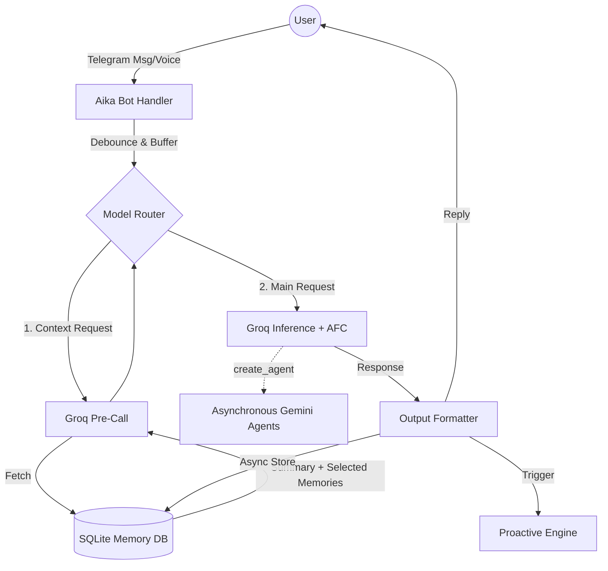

# Aika - V4 System Architecture

Aika is an advanced, autonomous Telegram AI agent engineered to run on a Raspberry Pi 5. Built with a **Groq-first** inference engine for ultra-low latency, it handles tool execution natively and employs **Gemini** specifically for asynchronous, sandboxed agent tasks. Aika features a multi-tiered memory system, proactive messaging chains, and dynamic reasoning allocation.

## Core Philosophy
1. **Low Latency**: Primary reasoning goes through Groq (gpt-oss-120b/kimi-k2-instruct-0905/llama-3.3-70b-versatile) because speed is critical for a conversational agent. Groq natively handles context selection, text generation, and tool execution.
2. **Robust Fallback**: If the primary model fails, Aika seamlessly rotates through a configured fallback chain of other high-performance models.
3. **Continuous Background Consolidation**: Memory shouldn't block response generation. Compaction and summarization run asynchronously.
4. **Proactive Agency**: Aika initiates conversation without user prompts using internal timer cascades and conditional "thoughts".

---

## Architecture Flow



---

## 1. Request Lifecycle (Runtime Contract)

Every user interaction follows a strictly timed and debounced pathway:

1. **Input Debounce (0.8s)**: Multiple rapid-fire messages are buffered and merged to prevent response collisions.
2. **Memory Pre-Call (`memory.prepare_inference_context`)**: Aika queries Groq to select relevant episodic and semantic memories based on the current context summary.
3. **Reasoning Extraction**: Aika extracts the required reasoning level (low, medium, high) from the prompt or context to dynamically adjust the computational effort.
4. **Response Generation**:
   - **Groq Main Process**: Generates response text and natively handles all tool executions in a continuous AFC loop.
   - **Background Agents**: Long-running or complex tasks can be delegated to asynchronous Gemini sandboxes.
5. **Async Storage**: Responses are injected into the standard memory layers asynchronously.
6. **Compaction Check**: Every 5th interaction, Aika safely compacts oldest messages into a rolling conversation summary in the background.

---

## 2. Memory Architecture & Consolidation

Memory is managed natively using `aiosqlite` and is segmented into distinct tiers.

### Data Hierarchy
- **Conversation Context (CC)**: Holds the current rolling summary of the active conversation + the latest 15-20 uncompressed messages. 
- **Episodic Memories**: Auto-extracted discrete events or facts from closed conversations.
- **Semantic Memories**: General truths or long-term preferences extracted from daily summaries.
- **Day Memories**: Roll-ups of all closed conversations across a single calendar day.
- **Global Memory**: The ultimate rolled-up summary of everything Aika knows about the user, merging Day Memories daily.

### Automated Job Schedule (APScheduler)
Aika runs self-maintenance independently:
- **Every 5 Minutes**: `close_stale_conversations` runs. Closes any conversation inactive for > 30 mins, extracting a summary and new episodic memories.
- **Every day at 4:00 AM**: `run_daily_summary`. Condenses the day's events into Day Memories and identifies Semantic Memories.
- **Every day at 4:10 AM**: `run_global_update`. Fuses Day Memories into the Global Memory state.
- **Sundays at 4:20 AM**: `run_weekly_cleanup`. Clears out obsolete or duplicate episodic/semantic nodes to respect token budgets.

---

## 3. Proactive Engine

Aika exhibits human-like agency without being prompted continuously.

1. **Post-Response Timer**: After replying, Aika begins a 10-second background timer.
2. **Thought Cycle**: It sends the context to Groq to generate a "thought". If the thought is `[NO]`, Aika goes dormant.
3. **Action Cycle**: If a thought is produced, Aika acts on it, sends a proactive message to the user, and re-triggers the timer for a maximum of 2 consecutive proactive jumps.
4. **Interruption Handling**: If the user types or reacts to a message, pending proactive loops are instantly cancelled or restarted seamlessly.

---

## 4. Provider & Model Routing

Aika now uses a simplified and robust fallback chain for main text generation.

### Target Models Chain
1. `openai/gpt-oss-120b` (Primary)
2. `llama-3.3-70b-versatile` (First Fallback)
3. `moonshotai/kimi-k2-instruct-0905` (Second Fallback)

If all models fail on the primary Groq key, Aika seamlessly rotates to the next available Groq API key from `GROQ_API_KEYS`.

`qwen/qwen3-32b` is dedicated strictly to Pre-Call context extraction and memory operations.

### Prompt Tags
Users can override the reasoning level explicitly by writing tags in their messages. Tags are stripped before reaching the model:
- `[REASONING=low|medium|high]`

---

## 5. Tool Surface & AFC (Automatic Function Calling)

Aika has deep integration with the host environment natively via Groq's tool usage loop. Sync tools are safely executed through thread executors to not block the main asyncio loop. Available tools include:

- **Host Interface**: `execute_shell_command`, `read_server_logs`, `list_directory`, `read_file`, `write_file`
- **Memory Interface**: `recall_memory`, `list_memories`, `delete_memory`, `edit_memory`
- **Time Interface**: `schedule_wake_up(seconds, thought, reasoning)`
  *(e.g., Aika can command herself to "wake up" 2 hours from now using high reasoning to analyze a log file)*

---

## Setup & Deployment

### Environment Requirements
- Python 3.11+
- `TELEGRAM_BOT_TOKEN`
- `GROQ_API_KEYS` (Comma-separated for multiple fallback keys)
- `ALLOWED_USER_ID`
- `GEMINI_API_KEYS` (Optional, comma-separated, required for fallback/tools)
- `AIKA_STARTUP_MESSAGE` (Optional, defaults to true)
- `AIKA_DB_PATH` (Optional, defaults to internal `aika.db`)

### Running Aika
```bash
pip install -r requirements.txt
python -m src.main
```

### Monitoring via systemd
Aika generates verbose logs for memory consolidation and context switching:
```bash
sudo journalctl -u aika -f
tail -f aika.log
```
